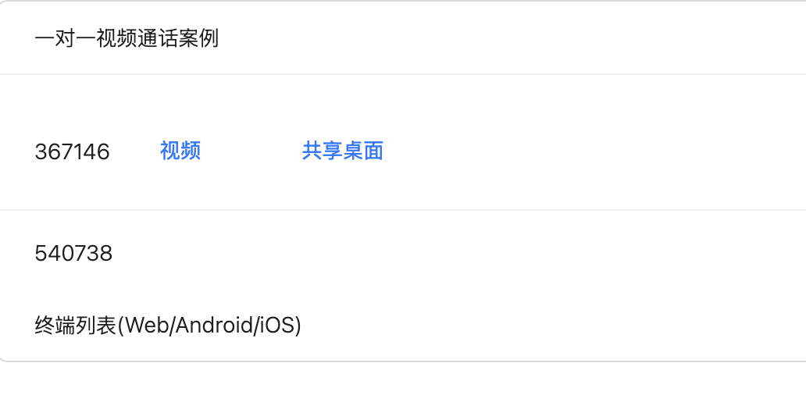
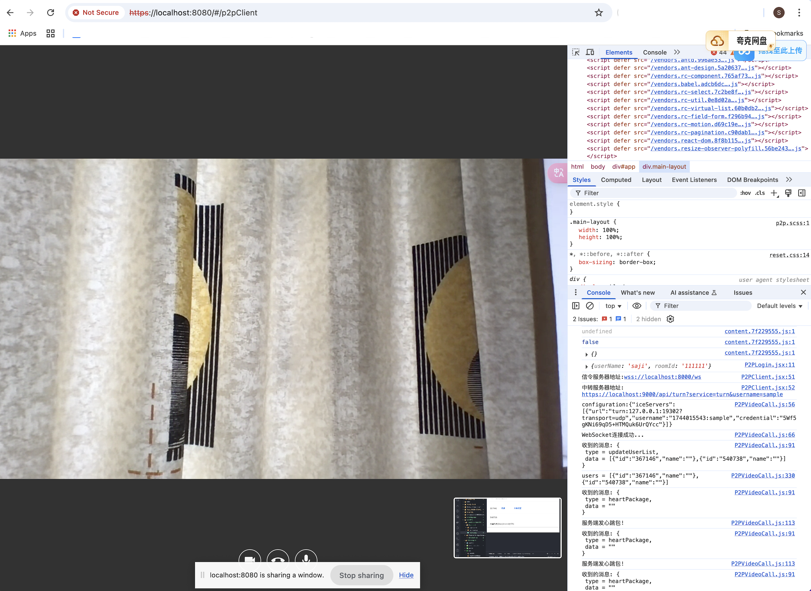

## 一对一视频通话

### Back-end:
```bash
git clone git@github.com:jireve999/1to1Video-WebRTC.git
```
#### 1.p2p-server
```bash
cd p2p-server
go run main.go

信令服务器地址:
wss://localhost:8000/ws
浏览器里以https开头才能访问
https://localhost:8000/ws
```

#### 2.turn-server
```bash
cd turn-server
go run main.go

中转服务器地址:
https://localhost:9000/api/turn?service=turn&username=sample
```

### Front-end:
```bash
git clone git@github.com:jireve999/WebRTC-samples.git
npm install
npm run start
# or
npm run build
见https://github.com/jireve999/WebRTC-samples/tree/main/src/p2p
```

Open [https://localhost:8080](https://localhost:8080) with your browser to see the result.



